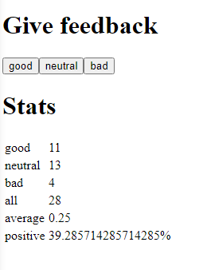

# Part 1 - Introduction to React

Our first introduction to React. The focus is on the basics, here.

### Anecdotes 
Simple web app that cycles through various software anecdotes. Can vote for each one. The highest voted anecdote is always shown and updates accordingly.

### Unicafe
Web app that takes vote input on 'good', 'bad', and 'neutral'. These correspond to +1, -1 and 0 respectively. Keeps track of various stats about the votes.

### Courseinfo
Exercise in React components. Displays simple data from an array onto a web page.

