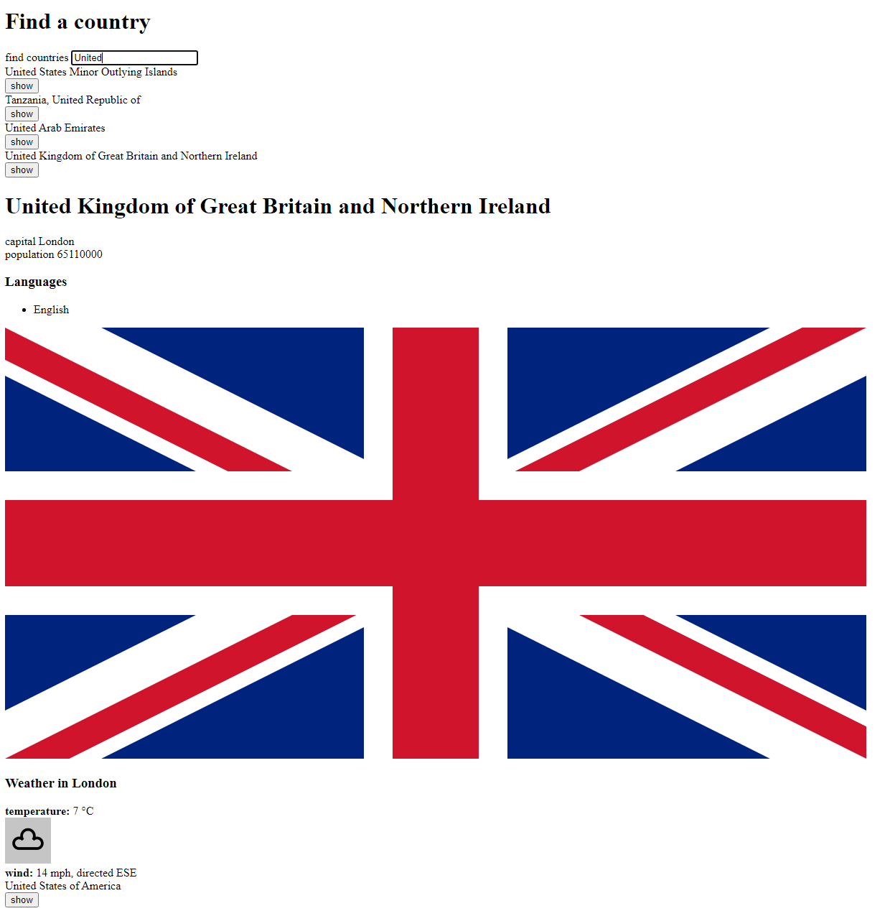
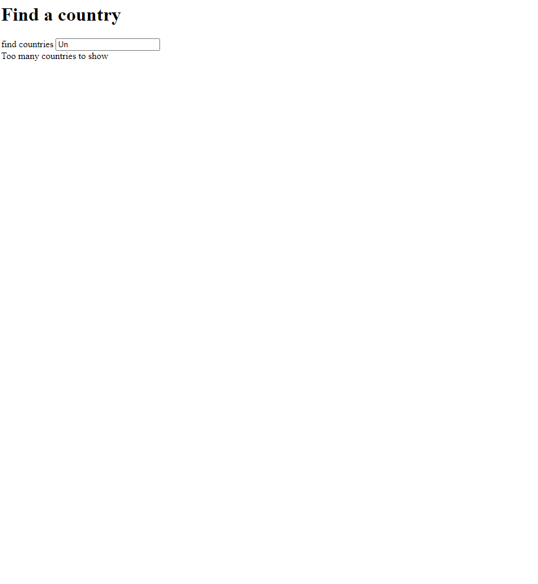
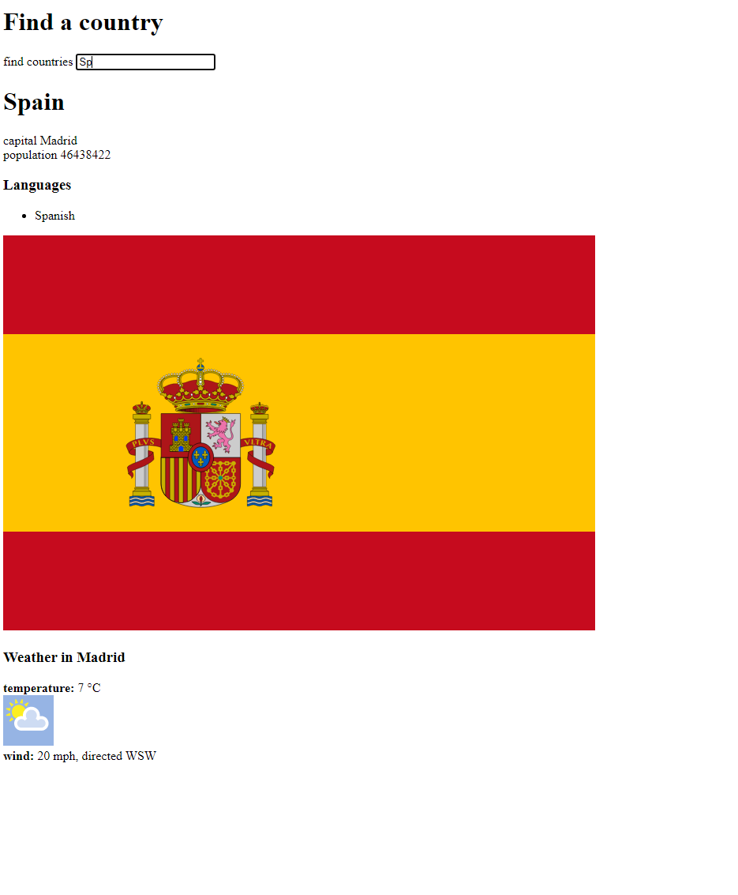
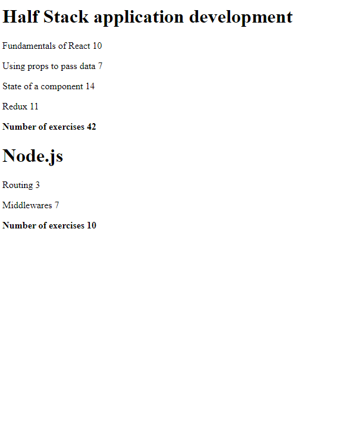

# Part 2 - Communicating with server

Continuation of React. We start interacting with servers and APIs in this part.

### Phonebook

This exercise is actually combined with exercises in part 3 and deployed as a full stack application. That can be found and played with [here](http://fullstackopen-part3tynan.herokuapp.com/).

### Countries

Web application that interacts with the Weatherstack API. Filters out countries using the search bar, and when less than 10 countries are returned, it gives a list. More info can be shown by pressing the 'show' button or filtering out one country on its own.

I thought this one was cool, actually.

### Courseinfo

Refactor and evolution of the previous application. More sophisticated use of components here.

