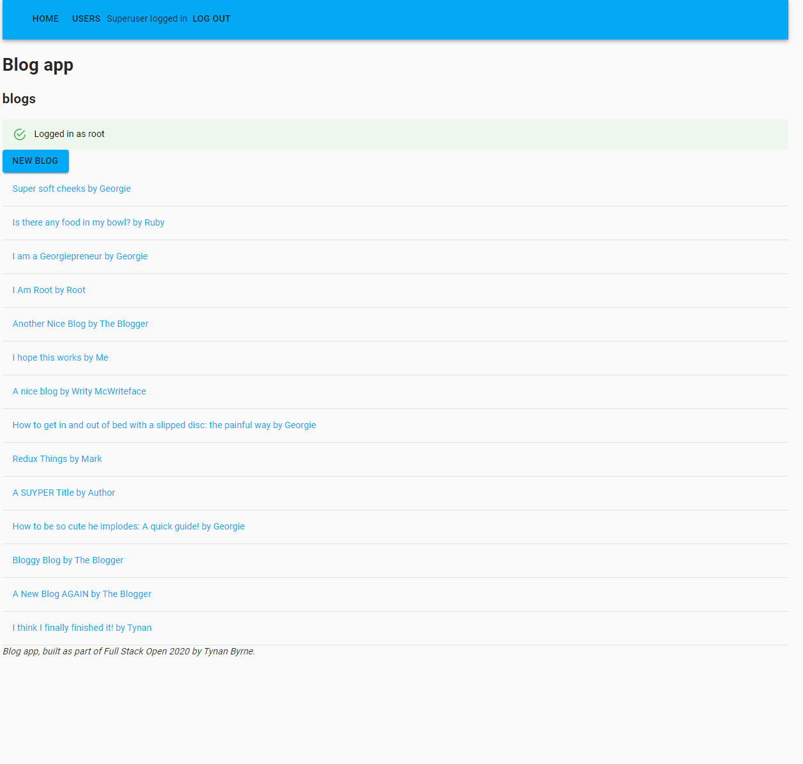
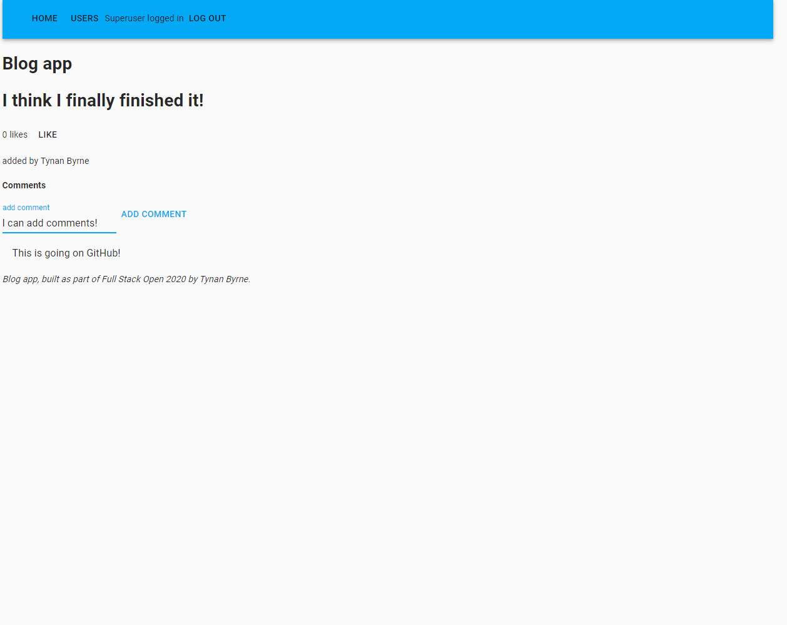
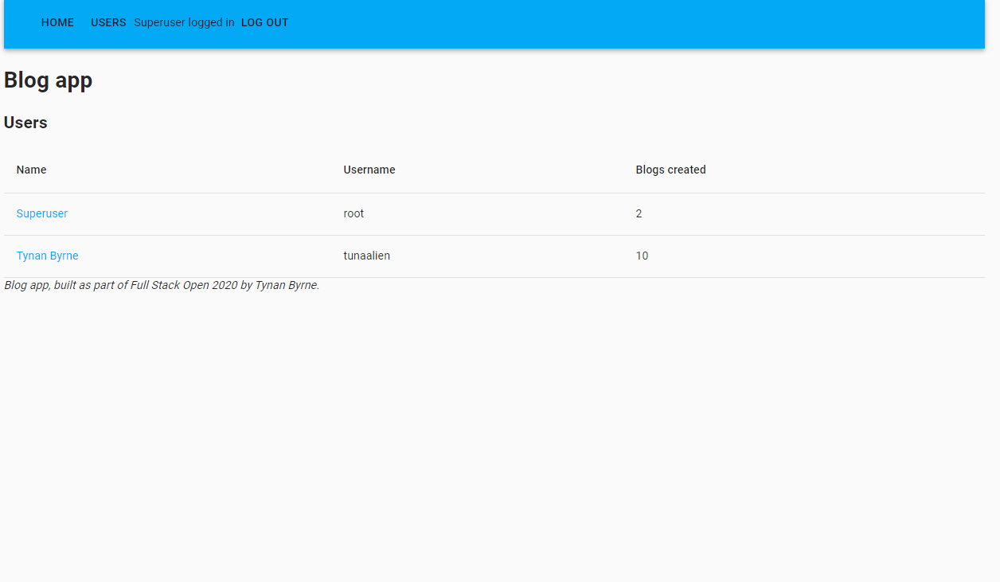
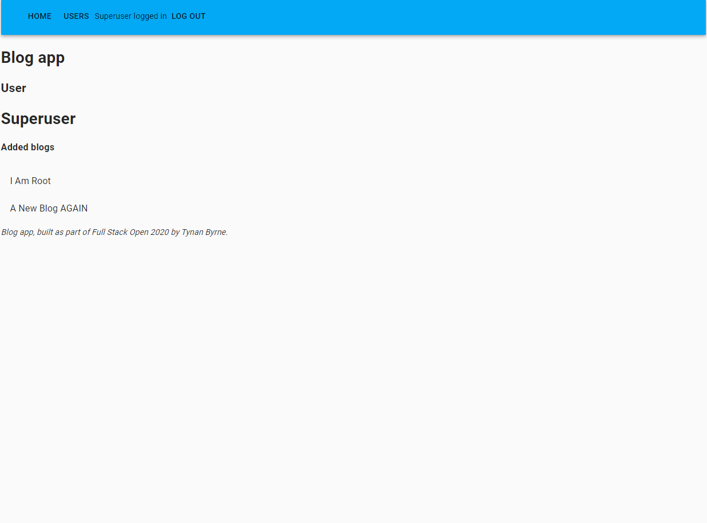

# Part 5 - Testing React apps

In this part, a front end for the back-end built in part 4 is built and tested. This part is actually the target of a large refactor to use a UI library and to use Redux, and is the most substantial application built in the course so far.

The blog list app allows for user authentication and for the user to log in and out. Once logged, in the user can see a list of blogs and click any one blog to see it in more detail. Users can add new blogs, add comments to blogs, and delete their own entries. A list of the users can also be viewed, with a list of the blogs each user has added being visible in a more detailed view upon clicking. Notifications appear for both sucessful operations and errors.

