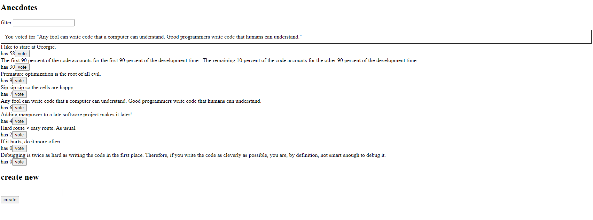
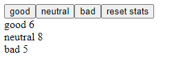

# Part 6 - State management with Redux

This section of the course focuses on Redux. This part involves refactoring the previous web applications made before to use a more sophisticated state management system.

### redux-anecdotes

The previous anecdotes application is made more complex and now uses Redux for the state management.

### unicafe-redux

A cut down version of the previous unicafe application that serves as an introduction to Redux.

