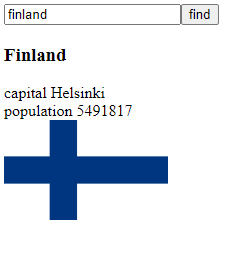
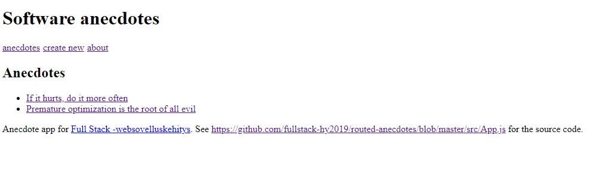
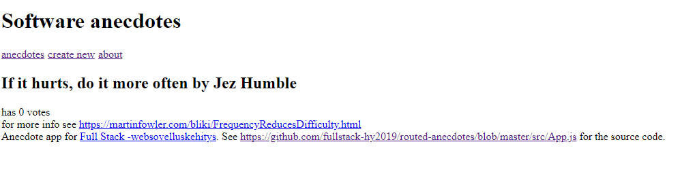
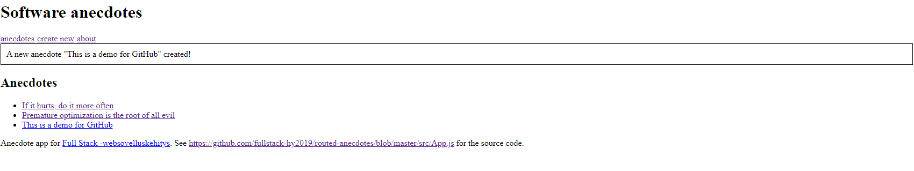
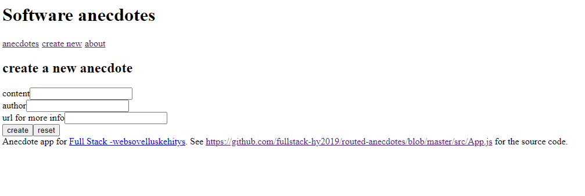
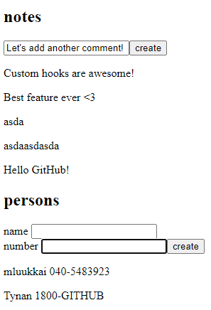

# Part 7 - React router, custom hooks, styling app with CSS and webpack

A mismatch of topics, part 7 aims to round out our React knowledge and experience.

### country-hook

A redo of one of my favourites. This version of the countries app uses a custom 'useCountry' hook that significantly cleans up the code by moving the logic of grabbing the JSON data of a country when searched to its own function.

### routed-anecdotes

Yet another version of the anecdotes app. This time, it uses React router to look and feel (a bit) more like a traditional website.

### ultimate-hooks

An amalgamation of the notes app and the phonebook app previously used as examples in the course. This one uses a JSON server to simulate a database, so that hooks that fetch resources from another server can be practised.

