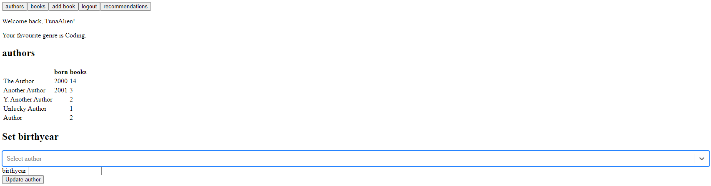
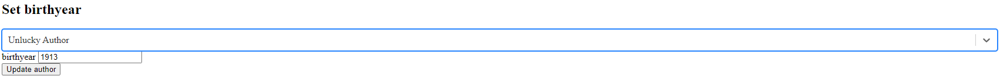
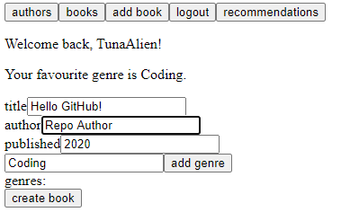
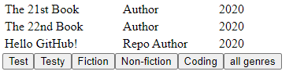
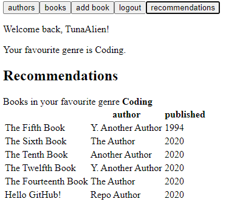

# Part 8 - GraphQL

After using REST APIs exclusively up to and including part 7, part 8 aims to teach GraphQL. The focus here is to build a library app that lists various books and all of the authors that wrote them.

The back-end involves setting up the GraphQL server and getting it to play nicely with the MongoDB database. The front-end then makes all of this data easily accessible, and allows for users to add and update data about books/authors as they please.

Here, state ends up being managed automatically by GraphQL and Apollo.

