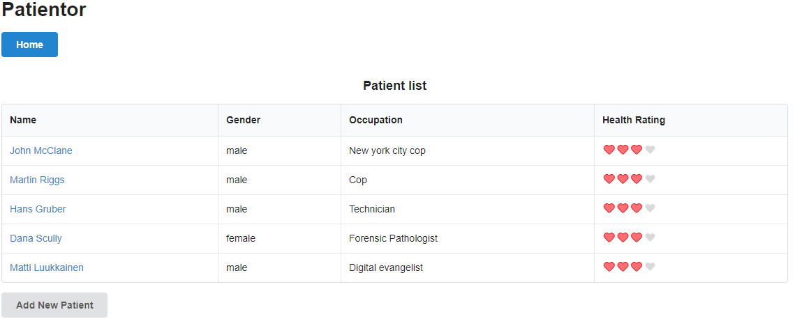
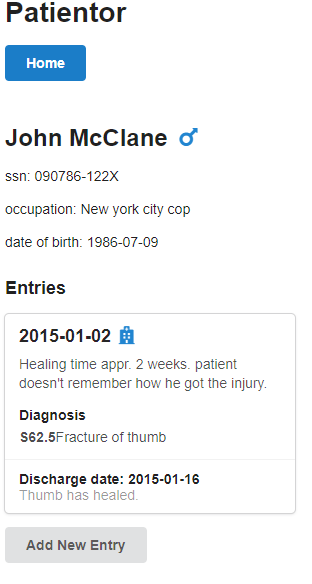
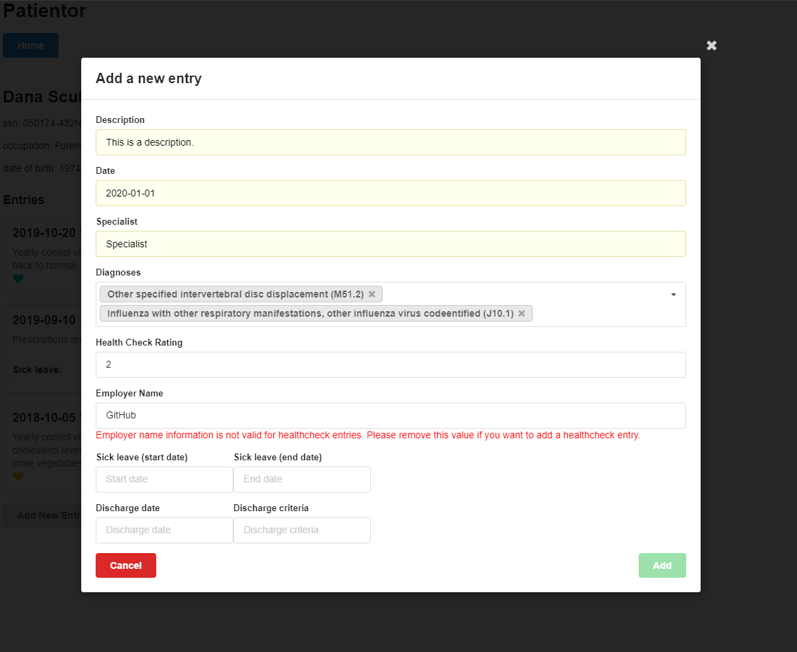
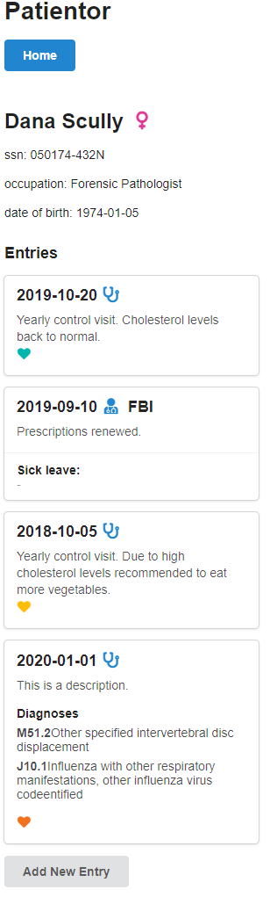

# Part 9 - TypeScript

The penultimate part of the course teaches TypeScript. The focus here is working on an app that already has an established code base, and finishing things off. Some basic command line apps are made to introduce TypeScript concepts, as well as a typed version of the classic 'courseinfo' exercise.

## Patientor

Patients can be added to the list, and each patient can have health entries added for them. These health entries can be of different types. A UI library is used to make it look pretty.

